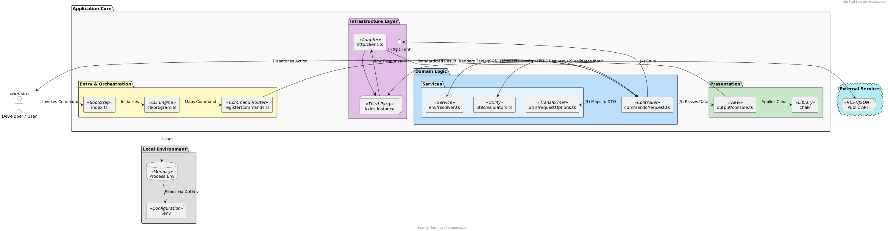

<div align="center">

# ⚡ ShellReq

**A lightweight terminal-native API testing tool for developers.**

Fast. Scriptable. Git-friendly. Optimized with Axios.

[](https://www.npmjs.com/package/shellreq)
[](https://github.com/maheshshinde9100/ShellReq)
[](LICENSE)
[](https://nodejs.org/)

</div>

---

## Why ShellReq?

I got tired of opening heavy GUI apps like Postman just to fire a quick API request. **ShellReq** is a simple CLI tool that lets you:

- **Fast Execution**: Make HTTP requests straight from your terminal.
- **Git Friendly**: Save your requests as shell scripts or CI/CD steps.
- **Environment Support**: Use `.env` files to switch between Dev, Staging, and Prod.
- **Zero Configuration**: Just install and start testing.

---

## Installation

Install ShellReq globally to use it anywhere in your terminal:

```bash
npm install -g shellreq
```

Or run it instantly using npx:

```bash
npx shellreq get https://jsonplaceholder.typicode.com/posts/1
```

---

## Usage & Examples

### 1. Basic GET Request
```bash
shellreq get https://jsonplaceholder.typicode.com/posts/1
```

### 2. POST with JSON Body
```bash
shellreq post https://jsonplaceholder.typicode.com/posts --json '{"title": "New Post", "body": "Mahesh Shinde", "userId": 1}'
```

### 3. PUT (Update)
```bash
shellreq put https://jsonplaceholder.typicode.com/posts/1 --json '{"id": 1, "title": "Updated Title"}'
```

### 4. DELETE
```bash
shellreq delete https://jsonplaceholder.typicode.com/posts/1
```

### 5. Custom Headers (`-H`)
```bash
shellreq get https://api.example.com/data \
  -H "Authorization: Bearer YOUR_TOKEN" \
  -H "Content-Type: application/json"
```

### 6. Verbose Mode (`-v`)
Show full response headers for debugging:
```bash
shellreq get https://jsonplaceholder.typicode.com/posts/1 --verbose
```

---

## Environment Variables

Create a `.env` file in your project:
```env
API_URL=https://jsonplaceholder.typicode.com
```

Use it in your commands with double curly braces:
```bash
shellreq get "{{API_URL}}/posts/1"
```

---

## Tech Stack
- **Engine**: [Axios](https://axios-http.com/) (Optimized for speed and reliability)
- **CLI Parsing**: [Commander.js](https://github.com/tj/commander.js/)
- **Styling**: [Chalk](https://github.com/chalk/chalk)
- **Environment**: [Dotenv](https://github.com/motdotla/dotenv)

---

## Contributing
This is an open project. Feel free to open issues or PRs on [GitHub](https://github.com/maheshshinde9100/ShellReq).

---

## License
[MIT](LICENSE)

---

## System Architecture



<div align="center">
  Built by <a href="https://github.com/maheshshinde9100">Mahesh Shinde</a>
</div>
