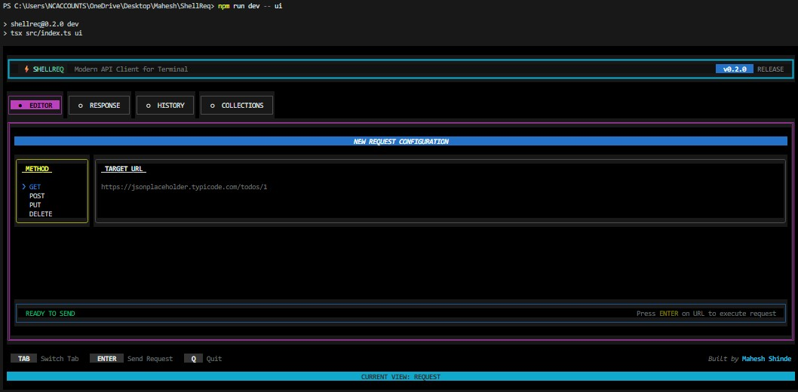
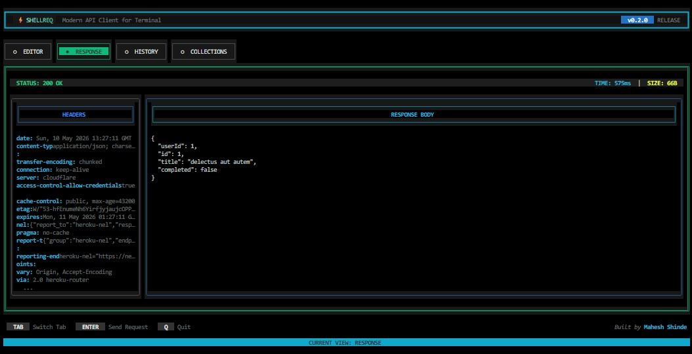

<div align="center">

# ⚡ ShellReq

**A lightweight, interactive terminal-native API testing tool for developers.**

Fast. Scriptable. Beautiful TUI. Optimized with Axios.

[](https://www.npmjs.com/package/shellreq)
[](https://github.com/maheshshinde9100/ShellReq)
[](LICENSE)
[](https://nodejs.org/)

</div>

---

## Why ShellReq?

I got tired of opening heavy GUI apps like Postman just to fire a quick API request. **ShellReq** brings the power of a modern API client directly into your workflow:

- **Interactive TUI**: A full-screen terminal UI for managing requests (v0.2.0+).
- **Fast Execution**: Make HTTP requests instantly without leaving your terminal.
- **Git Friendly**: Save your requests as shell scripts or CI/CD steps.
- **Environment Support**: Seamlessly use `.env` files for multi-environment testing.
- **Zero Configuration**: Just install and start testing.

---

## Interactive Mode (TUI) ⚡

The killer feature of ShellReq. A "Postman-like" experience completely inside your terminal.

```bash
shellreq ui
```

**Features:**
- **Dynamic Request Editor**: Switch methods (GET, POST, etc.) and enter URLs with a focused, interactive UI.
- **JSON Body Support**: Built-in editor for payloads in POST/PUT/PATCH requests.
- **Split-Pane Response Viewer**: View status codes, response times, headers, and formatted bodies side-by-side.
- **Automatic History**: Keeps track of your last 50 requests automatically.
- **Collections**: Save and organize your most used requests for instant reuse.

### Screenshots

*The Interactive Request Editor with Method Selection and URL input.*


*Split-pane Response Viewer showing Headers and JSON Body.*

---

## VS Code Extension 

ShellReq is now available directly inside Visual Studio Code! Enjoy a full-featured API workspace in your sidebar, just like Thunder Client.

[**Download ShellReq API Client for VS Code**](https://marketplace.visualstudio.com/items?itemName=maheshshinde9100.shellreq-api-client)

**Extension Features:**
- Persistent Collections & Auto-History.
- Sidebar GUI for seamless testing without leaving the editor.
- Multi-Method & Payload Body support.

---

## Installation

Install ShellReq globally to use it anywhere:

```bash
npm install -g shellreq
```

Or run it instantly using npx:

```bash
npx shellreq ui
```

---

## 🛠 Usage & Examples (CLI)

### 1. Basic GET Request
```bash
shellreq get https://jsonplaceholder.typicode.com/posts/1
```

### 2. POST with JSON Body
```bash
shellreq post https://jsonplaceholder.typicode.com/posts --json '{"title": "New Post", "body": "Mahesh Shinde"}'
```

### 3. Custom Headers (`-H`)
```bash
shellreq get https://api.example.com/data -H "Authorization: Bearer TOKEN"
```

### 4. Verbose Mode (`-v`)
Show full response headers for debugging:
```bash
shellreq get https://jsonplaceholder.typicode.com/posts/1 --verbose
```

---

## Environment Variables

Create a `.env` file in your project:
```env
API_URL=https://jsonplaceholder.typicode.com
```

Use it in your commands:
```bash
shellreq get "{{API_URL}}/posts/1"
```

---

## Tech Stack
- **Engine**: [Axios](https://axios-http.com/)
- **Interactive TUI**: [Ink](https://github.com/vadimdemedes/ink) (React for CLI)
- **CLI Parsing**: [Commander.js](https://github.com/tj/commander.js/)
- **Styling**: [Chalk](https://github.com/chalk/chalk) & [Ink-Gradient](https://github.com/vadimdemedes/ink-gradient)
- **Environment**: [Dotenv](https://github.com/motdotla/dotenv)

---

## Contributing
This is an open project. Feel free to open issues or PRs on [GitHub](https://github.com/maheshshinde9100/ShellReq).

---

## 📄 License
[MIT](LICENSE)

---

<div align="center">
  Built by <a href="https://github.com/maheshshinde9100">Mahesh Shinde</a>
</div>
